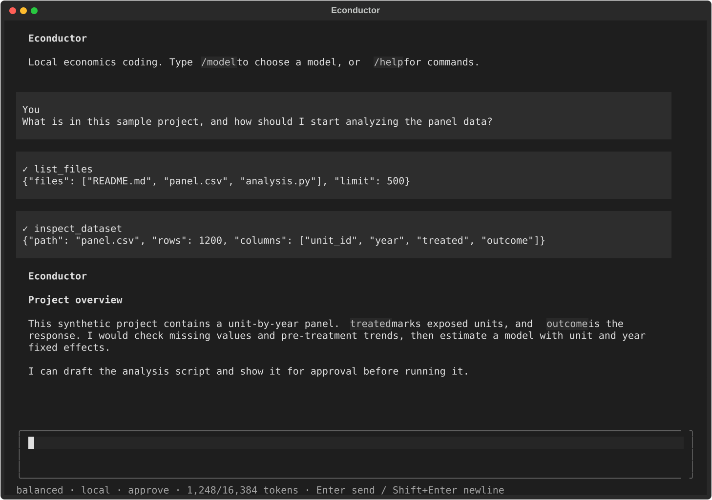

# Econductor



*Illustrative session using synthetic data.*

A local terminal coding agent for economists on Apple Silicon Macs. Models, project data, conversations, and analysis stay on your machine. Only explicit setup/model-download actions use the internet.

## Set up on a Mac

Econductor requires an Apple Silicon Mac with macOS 15 or newer, [uv](https://docs.astral.sh/uv/getting-started/installation/), and enough unified memory and disk space for the model you choose. Python analysis packages install with the app; R and licensed Stata are optional. Use a normal Mac terminal for setup because a terminal embedded in another sandbox may prevent Econductor's offline safety check from running.

1. Download or clone this repository, open Terminal.app, and change into its `econductor` folder.
2. Run `./bootstrap.sh` **once**. It installs the locked Python dependencies, places an `econductor` command in your user executable directory, checks the local sandbox and GPU, and starts the setup wizard. If you already have Stata, accept the detected executable or enter its full path. Hugging Face login is optional for public presets; if you choose to log in, supply a **read** token. Econductor stores it in macOS Keychain. If setup adds the executable directory to your shell's `PATH`, open a new Terminal window afterward.
3. Choose a specific research-project folder containing the data you want to use. In that folder, run `econductor`:

   ```sh
   cd /path/to/research-project
   econductor
   ```

   You can also run `econductor chat /path/to/research-project` from elsewhere. Run `econductor doctor` and `econductor models list` to check the machine and available models.

4. Type `/model` in chat. The picker shows the Mac's estimated fit. Choosing a model that is not already local **starts its download**; setup never downloads model weights. For a first run, try `light` for speed or `balanced` for general work. Ask a simple question about the selected project to test it.

You can also download one preset explicitly with `econductor models download balanced`. Bootstrap uses the repository's locked dependencies; after that, ordinary `econductor` commands do not invoke uv or a package registry. Keep the downloaded Econductor code folder in place: the command installed by bootstrap points to its Python environment. An explicit `/model` choice or `models download` still contacts Hugging Face. Model inference, file inspection, analysis, and conversations stay local. Choose a project folder rather than your home directory or the Econductor code folder. The project's `.econductor/` contains transcripts and results; add it to that project's `.gitignore` and keep it with your restricted data.

If `econductor` says “command not found,” open a new Terminal window after bootstrap. If it still fails, run `uv tool update-shell` and open another Terminal window. `uv run econductor` only finds the app when invoked inside the Econductor code checkout; use the installed `econductor` command in research folders. If setup reports that `sandbox-exec` cannot apply a default-deny profile, run `./bootstrap.sh` directly in Terminal.app, then check `econductor doctor` again. Econductor leaves execution disabled if that safety check fails. A failed model download can be resumed by selecting the same preset again. R and Stata require their own installations; the setup wizard can locate them but does not install or license them.

## Workflow

- Enter sends a prompt; Shift+Enter or Ctrl+J inserts a newline. Escape cancels work.
- `/model` selects a model; `/permissions` selects approve, read-only, or autonomous.
- `/new`, `/resume`, `/status`, `/help`, `/quit` manage the session.
- Approve mode previews generated code and diffs before applying/executing them. Its approval dialog offers Approve once, Deny, and Auto approve this session. Session auto approval includes later code-file overwrites and resets on `/new`, `/resume`, or restart; original datasets and the sandbox remain protected. Autonomous mode permits project code edits and isolated analysis without repeated approval, but still asks before overwriting code files.
- Ask the agent to inspect schemas, clean data, query with SQL, run regressions in Python/R/Stata, save charts, or search local papers and codebooks. Results cite saved scripts, logs, and artifacts.

Python analysis packages ship with the app. Install R and licensed Stata yourself; configure Stata during setup or edit the local settings file. Analysis cannot install packages from the internet. Use built-in Python tools or install required R/Stata packages separately before an offline session.

## Models and Mac requirements

`/model`, `models list`, and `doctor` compare each preset with this Mac's **total unified memory** and free disk space. “Minimum” means a possible but potentially tight run; “comfortable” leaves more room for macOS, the model's context cache, and other work. These are Econductor planning estimates, **not measured guarantees or a quality ranking**. Long prompts, other open apps, and large data analyses can raise memory use. The download figures are rounded from the linked Hugging Face repositories as of September 2026; the exact size is checked again before any explicit download.

| Preset | MLX model | Best starting use | Download | RAM minimum / comfortable |
| --- | --- | --- | ---: | ---: |
| `light` | [Qwen3.5-4B 4-bit](https://huggingface.co/mlx-community/Qwen3.5-4B-4bit/tree/main) | Quick folder questions, small edits, speed | ~3 GB | 8 / 16 GB |
| `balanced` | [Qwen3.5-9B 4-bit](https://huggingface.co/mlx-community/Qwen3.5-9B-4bit/tree/main) | General analysis, writing, and code | ~6 GB | 16 / 24 GB |
| `precision` | [Qwen3.5-9B 8-bit](https://huggingface.co/mlx-community/Qwen3.5-9B-8bit) | Compare higher precision at the same model size | ~11 GB | 24 / 32 GB |
| `large` | [Qwen3.5-27B 4-bit](https://huggingface.co/mlx-community/Qwen3.5-27B-4bit/tree/main) | Harder general analysis and longer code tasks | ~17 GB | 32 / 48 GB |
| `coder` | [Qwen3-Coder-30B-A3B 4-bit](https://huggingface.co/mlx-community/Qwen3-Coder-30B-A3B-Instruct-4bit/tree/main) | Coding and tool-use experiments | ~18 GB | 32 / 48 GB |
| `moe` | [Qwen3.5-35B-A3B 4-bit](https://huggingface.co/mlx-community/Qwen3.5-35B-A3B-4bit/tree/main) | Larger general-purpose MoE | ~21 GB | 36 / 48 GB |
| `coder-next` | [Qwen3-Coder-Next 4-bit](https://huggingface.co/mlx-community/Qwen3-Coder-Next-4bit/tree/main) | Larger coding-focused MoE | ~45 GB | 64 / 96 GB |
| `frontier` | [Qwen3.5-122B-A10B 4-bit](https://huggingface.co/mlx-community/Qwen3.5-122B-A10B-4bit/tree/main) | High-capacity general tasks when speed matters less | ~70 GB | 96 / 128 GB |
| `max` | [Qwen3-235B-A22B Instruct 3-bit](https://huggingface.co/mlx-community/Qwen3-235B-A22B-Instruct-2507-3bit/tree/main) | Experimental 128 GB ceiling; expect slow, tight operation | ~104 GB | 128 / 128 GB* |

*`max` is experimental even on 128 GB. Its weight files alone occupy about 103 GB, leaving little room for the OS and context cache. It may fail to load or swap heavily; it has not been run in Econductor on a 128 GB Mac. A model's “active” MoE parameter count does **not** mean only that fraction of its weights occupies memory. No large preset is downloaded automatically, and the picker leaves the final choice to you. For the largest models, keep substantially more free disk than the listed download size and close other memory-heavy apps.

More memory does not place an entire dataset into the model's context. Econductor uses disk-backed data tools and bounded previews; ask it to aggregate or sample a large dataset before requesting a regression. The default context is 16,384 tokens, with 4,096 reserved for generation. If the machine-fit label says “tight” or “below minimum,” try a smaller preset or shorter context. [MLX uses Apple's shared CPU/GPU memory pool](https://github.com/ml-explore/mlx/blob/main/docs/src/usage/unified_memory.rst), so RAM estimates include more than the model file on disk.

```sh
econductor models add my-model /path/to/mlx-model
econductor doctor
econductor evaluate balanced
```

Real-model evaluation is opt-in and never downloads a model. It is a synthetic smoke test, not an economics or coding benchmark. Models requiring remote Python code are unsupported. Weights are validated before registration and loaded from local paths only. Larger presets have verified repository listings and loader-family support, but have not been downloaded or run on the current 36 GB development Mac.

## Privacy and resource limits

Inference, data tools, and generated code run under macOS sandbox-exec with network denial, credential restrictions, and narrow writable locations. Downloads run in a separate helper without project paths or chat history. The controller handles the UI, approved file edits, and local session persistence; it is trusted application code. This is a prototype isolation layer, not an institutional security certification; run `doctor` and the sandbox tests on each supported OS before handling restricted data.

Original data are read-only during execution. Scripts write to a per-run artifact folder; modifying source data requires a separate, explicit user action outside the agent. External symlinks and private configuration files are inaccessible. Project directories are the approved data roots in v1: copy required external data into the selected project. Runtime libraries must be readable for Python/R/Stata to work, but credentials and session files are denied. There is no cloud fallback, telemetry, or background model download.

DuckDB queries CSV/Parquet with a 2 GB memory budget and disk spill. Excel/Stata imports use bounded chunks and cache Parquet alongside metadata. Stata extended missing values become nulls for SQL; original values/labels remain documented in the import metadata. For large files prefer SQL aggregation and selected extracts over loading an entire dataset into pandas/R/Stata. A 20 GB disk-backed query is a target workload, not a promise that a 20 GB regression fits in memory.

The initial context window is 16,384 tokens, reserving 4,096 for generation. When context fills, Econductor shortens tool output and condenses earlier actions so work can continue within the same session. Full transcripts and execution logs remain local; `/resume` reopens a saved session, including after `/new`. A single request that exceeds the context window still needs shortening. Heavy execution releases model memory. PDF search handles text, not scanned-document OCR. `econductor sessions delete <id> --project <folder>` removes a transcript; generated artifacts remain until explicitly removed by the user.

## Development

```sh
uv sync --frozen --group dev
uv run --offline pytest
uv run --offline ruff check .
uv run --offline pytest -m sandbox
uv run --offline python scripts/large_workload.py --size-gb 20
```

Routine tests are model-free. Sandbox integration tests must run on a host that permits sandbox-exec (some containers/agent sandboxes block nested sandboxing). See [the extension guide](docs/extensions.md) and [validation report](docs/validation.md).
